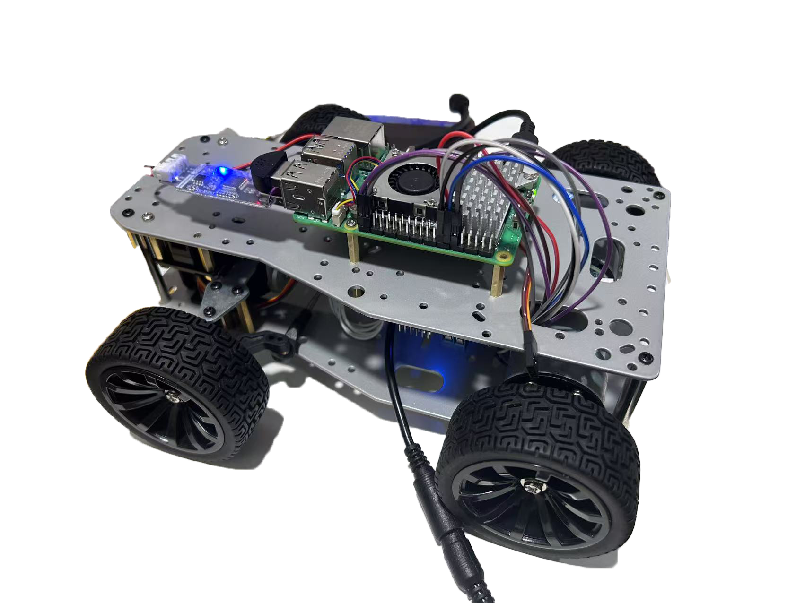

# **Smart Hospital Guide Robot (Raspberry Pi-Based)**  



[CHN Version](README_CN.md)  

## **Project Overview**  
This project is a smart hospital guide robot developed using Raspberry Pi. It aims to improve the efficiency of hospital services by helping patients navigate to the correct department based on their registration information. The robot features facial recognition, autonomous navigation, and obstacle avoidance to enhance the hospital experience.  

## **Key Features**  
- **Patient Identification**: Facial recognition through the camera to match patient information in the hospital database.  
- **Autonomous Navigation**: Guide patients to the corresponding department based on their registration information according to the map.   
- **Obstacle Avoidance**: Uses ultrasonic sensors to detect and avoid obstacles.  
- **Intelligent Steering**: Utilizes a gyroscope to ensure stable movement.  
- **Voice Interaction (Future Update)**: Provides voice guidance for a better user experience.  

## **Hardware Requirements**  
| **Component**         | **Purpose**                    |  
|----------------------|--------------------------------|  
| Raspberry Pi 5B     | Core computing module         |  
| Camera Module  | Facial recognition  |  
| Ultrasonic Sensor| Obstacle detection       |  
| Gyroscope (MPU6050) | Motion and direction sensing |  
| Motor Driver (L298N) | Controls the four-wheel movement |  
| 4WD Chassis        | Robot movement framework     |  
| Rechargeable Battery | Power supply                 |  


## **Project Structure**  

```markdown
include/
├── core/
├── drivers/
│   ├── hal/
├── utils/
config/
docs/
├── design/
├── api/
src/
├── core/
├── drivers/
│   ├── hal/
├── utils/
tests/
├── core/
├── drivers/
third_party/
scripts/
build/
```

## **Installation & Execution**  


## **Future Updates**  
| Version | Planned Features |  
|---------|-----------------|   
| v1.1    | Voice guidance, basic voice interaction |  
| v1.2    | Remote control (allow doctors to manually adjust navigation) |  
| v2.0    | AI-enhanced navigation, cloud-based data interaction |  
